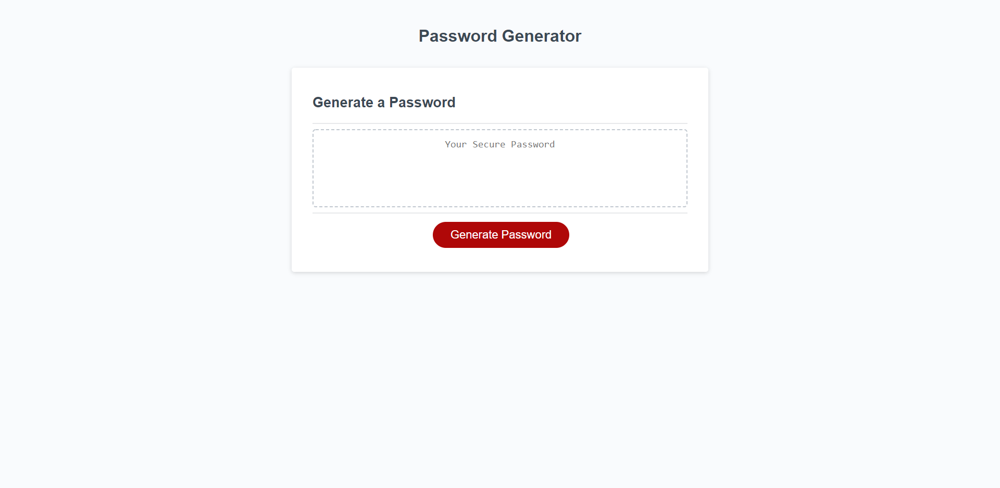

# 03 Javascript: Password Generator

## Instructions

Upon clicking the "generate password" button, the user will be prompted with a series of questions relating to the content of the password they would like created. Once these questions have been answered, the generated password will be output into the dashed-border text box

## Appearance

The top of the page contains a header reading "Password Generator". Below that, there is a box that contains another header labeled "Generate a Password". In the box, below the header there is a text box with a dashed border containing placeholder text that reads "Your secure password". Below the text box, there is a red button labaled "Generate Password".

